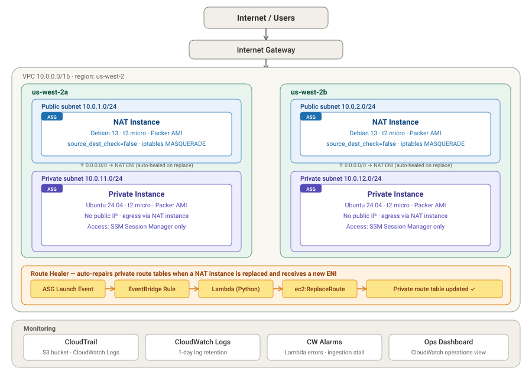

# Highly Available Web Application on AWS

A multi-AZ AWS infrastructure deployed with Terraform.

### NAT Gateway vs NAT Instance

**Choice:** NAT Instances (t2.micro, Debian), one per AZ, bootstrapped via user_data.

NAT Gateway is AWS's recommended default — managed, automatically HA within an AZ, throughput scales transparently. It's also ~$32/month per AZ before any per-GB processing charges. Two AZs comes out to ~$65/month sitting idle, which dominates the cost of an otherwise dormant portfolio stack.

NAT Instances flip the math. With t2.micro under the AWS Free Tier (750 instance-hours/month for the first 12 months), two of them running 24/7 are fully covered — NAT cost is effectively $0 for the duration of the free tier, then ~$17/month afterward. That's the difference between a stack I can leave running indefinitely and one I have to remember to `terraform destroy` between demos.

**Bootstrapping:** the instances run Debian and configure themselves at boot via `user_data`:
- Enable IPv4 forwarding (`net.ipv4.ip_forward=1`, persisted in `/etc/sysctl.d/`)
- Add an `iptables` MASQUERADE rule on the public-facing interface
- Persist iptables rules across reboot

The `source_dest_check = false` flag on the ENI is set in Terraform — it's an AWS-level setting that tells the VPC router to permit packets whose source or destination IP isn't the instance itself. Without it, NAT silently doesn't work.

**What I'm trading away:**

- **Managed HA.** A NAT Gateway recovers transparently if the underlying hardware fails. A NAT Instance is just an EC2 — if it dies, egress from that subnet stops. I mitigate by running one per AZ inside an Auto Scaling Group with `min`/`max`/`desired = 1`, so an instance failure auto-replaces and an AZ failure only takes out one path.
- **Operational ownership.** I own the AMI, OS patches, sizing, and the source/destination-check setting. AWS handles all of that for NAT Gateway.
- **Throughput ceiling.** t2.micro is bandwidth-limited and burst-credit-limited on CPU. Fine for this project; not fine for production-scale traffic.

**When this decision flips:** in a production environment with real traffic and SLAs, NAT Gateways become correct. The ~$65/month premium buys managed HA and removes a class of operational toil that easily costs more than that in engineering time the first time something breaks at 2am. The choice here isn't "NAT Instance is better" — it's "NAT Instance is better *for this context*: a free-tier portfolio environment where the cost ratio is extreme and downtime is harmless."

**Side benefit:** because private instances retain outbound internet via NAT, SSM Session Manager works without VPC interface endpoints (~$42/month for the `ssm` / `ssmmessages` / `ec2messages` trio across two AZs). Endpoints would only be required if I'd chosen fully isolated private subnets — appropriate for compliance-bound environments (HIPAA, PCI, FedRAMP), overkill here.

### 2 AZs vs 3 AZs

**Choice:** 2 Availability Zones.

Two AZs is the standard HA baseline in AWS, not a compromise on it. The ALB requires a minimum of 2 subnets in different AZs by design. RDS Multi-AZ deployments are inherently two-zone (primary + synchronous standby). The Well-Architected Framework treats 2 AZs as the bar that distinguishes "HA" from "single point of failure" — adding a third AZ doesn't move you across that bar; it adds margin past it.

**When a third AZ would actually matter:**

- **Quorum-based systems.** Distributed consensus (etcd, Consul, Zookeeper, Kafka with `min.insync.replicas=2`) requires a majority of nodes to acknowledge a write. With 3 nodes across 3 AZs, losing one AZ still leaves a 2-node majority and writes continue. With 2 nodes across 2 AZs, losing one AZ takes the cluster below quorum and writes stop. This is the canonical "you genuinely need 3 AZs" workload.
- **Read-heavy, latency-sensitive read replicas.** Spreading replicas across 3 AZs reduces the chance any given client is far from a healthy replica.
- **Strict regulatory uptime requirements** that mandate redundancy beyond single-failure tolerance.

**Why 3 AZs would have been wasted here:**

This stack is a stateless web app behind an ALB, backed by managed RDS. Neither tier has a quorum requirement. The ALB and Multi-AZ RDS each have their resilience semantics defined against 2 AZs. A third AZ would mean a third NAT instance, a third set of subnets and route tables, a third copy of every ASG instance, and roughly 50% more idle cost — buying nothing the workload can use.

**When this decision flips:** if I added a quorum-based component (a self-managed Kafka cluster, a Consul service mesh, a self-managed etcd-backed system), 3 AZs becomes the right answer immediately. The architecture's redundancy level should match the data plane's failure model, not exceed it for show.

### ALB vs NLB

**Choice:** Application Load Balancer (ALB).

The workload is an HTTP application. The ALB operates at Layer 7, which means it can inspect requests and make routing decisions based on path, host header, or other HTTP attributes. It supports HTTP-aware health checks (e.g. `GET /health` returns 200), TLS termination, cookie-based session stickiness, and integrates natively with target groups backed by an Auto Scaling Group.

**Why not NLB:** Network Load Balancer operates at Layer 4 (TCP/UDP) and is the right answer for non-HTTP protocols, ultra-high-throughput workloads (millions of connections/second, sub-millisecond latency), or when downstream systems need to whitelist a static IP. None of those apply here. Choosing NLB for a standard web app would mean giving up every Layer 7 feature — path routing, smart health checks, TLS at the edge — to gain raw performance the workload doesn't need.

**When this decision flips:** if I were fronting a non-HTTP service (a game server, a database proxy, an MQTT broker) or needed a static IP for an upstream firewall to whitelist, NLB would become correct.